# ---
# English Translation

## Polaris Connector → OpenMetadata

This connector automatically retrieves metadata from Apache Polaris (the Iceberg catalog) and sends it to OpenMetadata. No more manual work!

...existing code...

# ---
# Traducción al Español

## Conector Polaris → OpenMetadata

Este conector recupera automáticamente los metadatos de Apache Polaris (el catálogo Iceberg) y los envía a OpenMetadata. ¡No más trabajo manual!

...existing code...

# ---
# الترجمة إلى العربية

## موصل بولاريس → أوبن ميتاداتا

يقوم هذا الموصل باسترداد بيانات التعريف تلقائيًا من Apache Polaris (كتالوج Iceberg) وإرسالها إلى OpenMetadata. لا مزيد من العمل اليدوي!

...existing code...
# Connecteur Polaris → OpenMetadata

> Parce que les métadonnées, c'est la vie ! 📊

Ce petit connecteur permet de récupérer automatiquement les métadonnées d'Apache Polaris (le catalogue Iceberg) et de les envoyer vers OpenMetadata. Plus besoin de faire ça à la main !

## ✨ Ce que ça fait concrètement

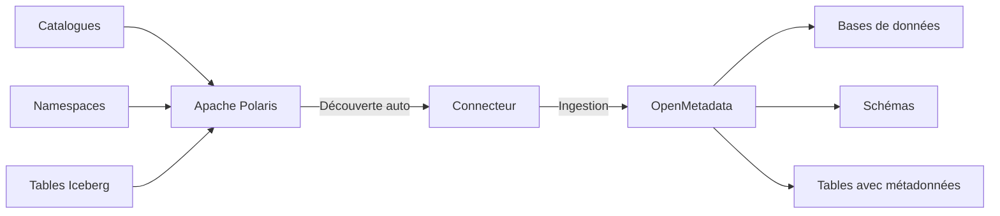

**En gros, le connecteur :**
- 🔍 **Explore** automatiquement tous vos catalogues Polaris
- 📋 **Récupère** les schémas de tables Iceberg (même les types complexes)
- 🏷️ **Tague** vos tables pour faciliter la gouvernance
- 🔒 **S'authentifie** avec OAuth2, clé API ou basic auth
- ⚡ **Filtre** ce que vous voulez ingérer (pratique pour les gros catalogues)

## � Comment c'est organisé

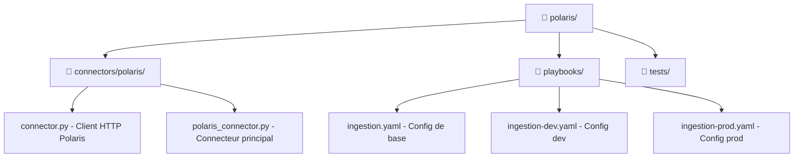

**Les fichiers importants :**
- `connectors/polaris/` → Le cœur du connecteur
- `playbooks/` → Vos configs d'ingestion (dev/prod)  
- `validate.py` → Script pour tester votre config
- `requirements.txt` → Les dépendances Python

## ⚡ Installation rapide

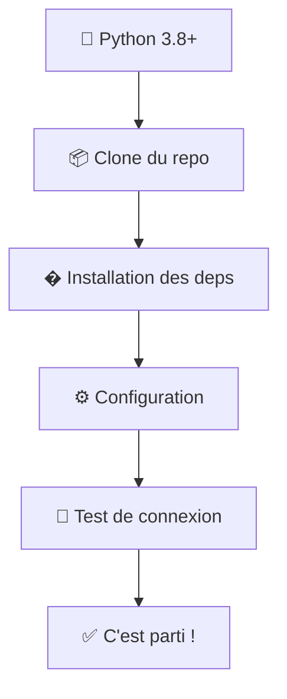

### 1. Prérequis
- Python 3.8 minimum (on est pas des sauvages)
- Une instance Polaris qui fonctionne
- OpenMetadata 1.4.0+ qui tourne
- Les credentials pour se connecter à Polaris

### 2. Installation des dépendances

```bash
# La méthode simple (recommandée)
pip install -r requirements.txt

# Ou si vous voulez installer OpenMetadata à la main
pip install "openmetadata-ingestion[pandas]" requests urllib3
```

### 3. Test rapide

```bash
# Tester si tout est bien installé
python validate.py

# Ou directement avec le script d'install
./setup.sh    # Linux/Mac
setup.bat     # Windows
```

## 🔧 Configuration (la partie fun)

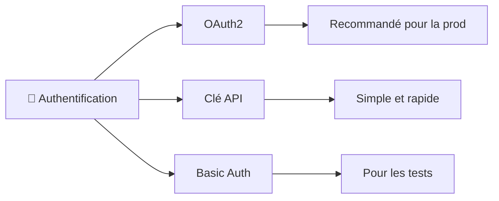

### Les 3 façons de s'authentifier

**OAuth2** (le plus secure) :
```yaml
auth_type: "oauth2"
client_id: "mon_client_id"
client_secret: "mon_super_secret"
# token_url: "/v1/oauth/token" # Optionnel
```

**Clé API** (simple et efficace) :
```yaml
auth_type: "api_key"  
api_key: "ma_cle_api_secrete"
```

**Basic Auth** (pour débuter) :
```yaml
auth_type: "basic"
username: "mon_user"
password: "mon_password"
```

### Configuration complète (exemple concret)

Éditez `playbooks/ingestion.yaml` avec vos vraies valeurs :

```yaml
source:
  type: customDatabase
  serviceName: mon-polaris  # Le nom qui apparaîtra dans OpenMetadata
  serviceConnection:
    config:
      type: CustomDatabase
      sourcePythonClass: connectors.polaris.polaris_connector.PolarisSource
      connectionOptions:
        # 🌐 Connexion Polaris
        host: "polaris.ma-boite.com"
        port: "8181" 
        use_ssl: "true"  # false en local, true en prod
        
        # 🔐 Authentification OAuth2
        auth_type: "oauth2"
        client_id: "polaris-client"
        client_secret: "super-secret-a-ne-pas-commiter"
        
        # ⚡ Timeouts (optionnel)
        connection_timeout: "30"
        request_timeout: "60"
        
        # 🎯 Filtres (vide = tout prendre)
        catalog_filter: "prod,staging"  # Seulement ces catalogues
        namespace_filter: ""            # Tous les namespaces
        
        # 🏷️ Tags par défaut
        default_tags: "Tier.Bronze,Source.Polaris"

# 📤 Où envoyer les métadonnées
sink:
  type: metadata-rest
  config: {}

# 🛠️ Config OpenMetadata  
workflowConfig:
  loggerLevel: INFO
  openMetadataServerConfig:
    hostPort: http://openmetadata:8585/api
    authProvider: openmetadata
    securityConfig:
      jwtToken: "votre-jwt-token-ici"
```

> 💡 **Tip de pro :** Ne commitez jamais vos secrets ! Utilisez des variables d'environnement.

## 🚀 Lancer l'ingestion

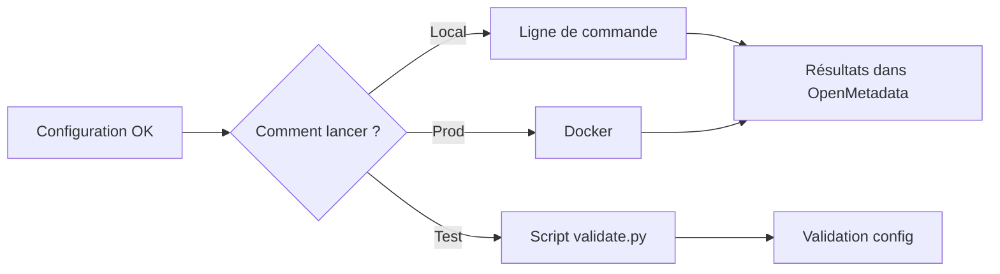

### En ligne de commande (méthode classique)

**⚠️ Important :** Lancez depuis la racine du projet !

```bash
# Linux/Mac
export PYTHONPATH="."
metadata ingest -c playbooks/ingestion.yaml

# Windows PowerShell  
$env:PYTHONPATH = "."
metadata ingest -c playbooks/ingestion.yaml

# Windows CMD
set PYTHONPATH=.
metadata ingest -c playbooks/ingestion.yaml
```

### Avec Docker (pour les pros)

```bash
# Build de l'image
docker build -t polaris-connector .

# Lancement avec votre config
docker run --rm \
  -v $(pwd)/playbooks:/app/playbooks \
  polaris-connector
```

### Test avant lancement (recommandé)

```bash
# Valider votre config d'abord
python validate.py

# Tester la connexion Polaris
python validate.py --test-connection

# Lancer l'ingestion si tout est OK
python validate.py --run
```

## ⚙️ Tous les paramètres possibles

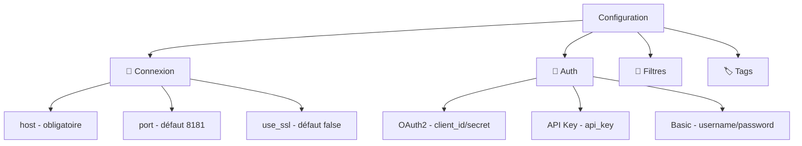

| Paramètre | Obligatoire | Défaut | Description |
|-----------|-------------|--------|-------------|
| `host` | ✅ | - | Adresse de votre serveur Polaris |
| `port` | ❌ | `8181` | Port du serveur |
| `use_ssl` | ❌ | `false` | HTTPS activé ou pas |
| `auth_type` | ❌ | `oauth2` | Type d'authentification |
| `client_id` | 🔐 | - | ID client OAuth2 (si oauth2) |
| `client_secret` | 🔐 | - | Secret OAuth2 (si oauth2) |
| `api_key` | 🔐 | - | Clé API (si api_key) |
| `username` | 🔐 | - | Utilisateur (si basic) |
| `password` | 🔐 | - | Mot de passe (si basic) |
| `catalog_filter` | ❌ | `""` | Catalogues à ingérer (séparés par virgule) |
| `namespace_filter` | ❌ | `""` | Namespaces à ingérer (séparés par virgule) |
| `default_tags` | ❌ | `""` | Tags par défaut (séparés par virgule) |

> **🔐 = Obligatoire selon le type d'auth choisi**

## 🧪 Tester la connexion (avant de se planter)

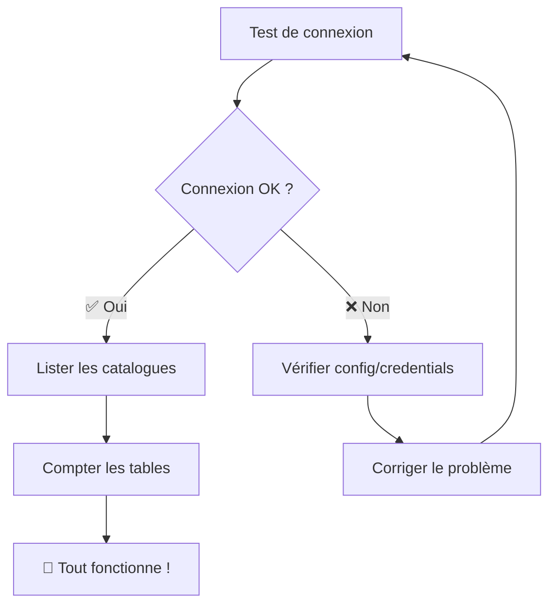

### Test rapide avec le script

```bash
# Test complet de la config
python validate.py --test-connection
```

### Test manuel en Python

```python
from connectors.polaris.connector import PolarisConnector

# Créer le connecteur avec vos paramètres
connector = PolarisConnector(
    host="polaris.ma-boite.com",
    port=8181,
    use_ssl=True,
    auth_type="oauth2",
    client_id="mon-client-id", 
    client_secret="mon-secret"
)

# Tester la connexion
if connector.connect():
    print("✅ Connexion réussie !")
    
    # Lister les catalogues disponibles
    catalogues = connector.get_catalogs()
    print(f"📚 Trouvé {len(catalogues)} catalogues")
    
    # Nettoyer
    connector.close()
else:
    print("❌ Connexion échouée - vérifiez vos credentials !")
```

## 📊 Correspondance des types de données

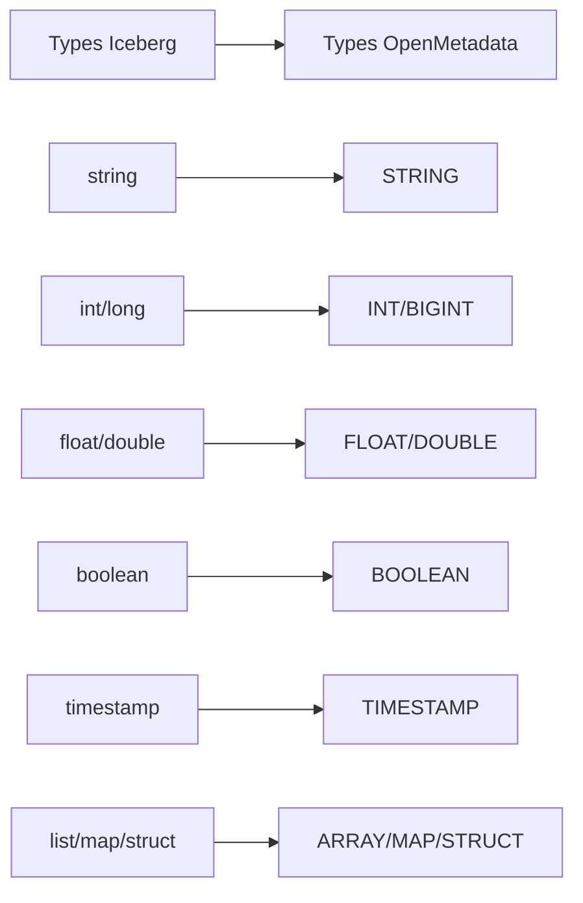

Le connecteur traduit automatiquement les types Iceberg :

| Type Iceberg | Type OpenMetadata | Exemple |
|--------------|-------------------|---------|
| `string` | `STRING` | Texte classique |
| `int`, `integer` | `INT` | Nombres entiers |
| `long` | `BIGINT` | Gros entiers |
| `float` | `FLOAT` | Décimaux simples |
| `double` | `DOUBLE` | Décimaux précis |
| `boolean` | `BOOLEAN` | true/false |
| `timestamp` | `TIMESTAMP` | Dates avec heure |
| `date` | `DATE` | Dates uniquement |
| `list` | `ARRAY` | Listes/tableaux |
| `map` | `MAP` | Dictionnaires clé/valeur |
| `struct` | `STRUCT` | Objets complexes |

> **💡 Pas de panique :** Le connecteur gère même les types complexes imbriqués !

## 🐛 Quand ça marche pas (debugging)

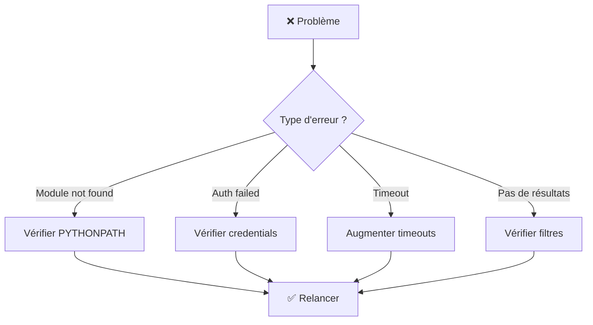

### Les pannes classiques (et leurs solutions)

**🔥 `ModuleNotFoundError: No module named 'connectors'`**
```bash
# Vous n'êtes pas dans le bon répertoire
cd /chemin/vers/polaris
export PYTHONPATH="."

# Ou il manque des __init__.py (normalement c'est bon)
ls connectors/__init__.py
ls connectors/polaris/__init__.py
```

**🔒 Erreurs d'authentification**
- Vérifiez vos `client_id`/`client_secret`
- Testez si Polaris est accessible : `curl http://polaris:8181/v1/config`
- L'URL du token est-elle correcte ?

**⏱️ Timeouts de connexion**
```yaml
connectionOptions:
  connection_timeout: "60"  # Au lieu de 30
  request_timeout: "120"    # Au lieu de 60
```

**📭 Aucun résultat d'ingestion**
- Vérifiez que Polaris a bien des catalogues/tables
- Vos filtres ne sont pas trop restrictifs ?
- L'utilisateur a-t-il les bonnes permissions ?

### Mode debug (pour voir ce qui se passe)

```yaml
workflowConfig:
  loggerLevel: DEBUG  # Au lieu de INFO
```

**Où trouver les logs :**
- Local : `~/.local/share/openmetadata/logs/`
- Docker : `/tmp/openmetadata_logs/`

## 🔒 Sécurité (important !)

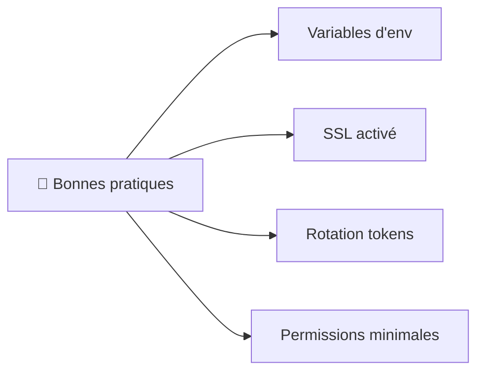

### Les règles d'or

1. **❌ Jamais de secrets dans Git** → Utilisez des variables d'environnement
2. **🔐 SSL en production** → `use_ssl: true` obligatoire
3. **🔄 Rotation des tokens** → Changez régulièrement vos clés
4. **👤 Permissions minimales** → Compte avec juste les droits nécessaires
5. **🛡️ Réseau sécurisé** → Firewall entre les composants

### Exemple avec variables d'environnement

```bash
# Définir les variables (à ne pas commiter)
export POLARIS_CLIENT_ID="mon-client-id"
export POLARIS_CLIENT_SECRET="mon-super-secret"  
export OPENMETADATA_JWT_TOKEN="mon-jwt-token"
```

Dans votre `ingestion.yaml` :
```yaml
connectionOptions:
  client_id: "${POLARIS_CLIENT_ID}"
  client_secret: "${POLARIS_CLIENT_SECRET}"

workflowConfig:
  openMetadataServerConfig:
    securityConfig:
      jwtToken: "${OPENMETADATA_JWT_TOKEN}"
```

> **💡 Pro tip :** Utilisez un fichier `.env` en local et un vault en prod !

## 🚀 Utilisation avancée (pour les experts)

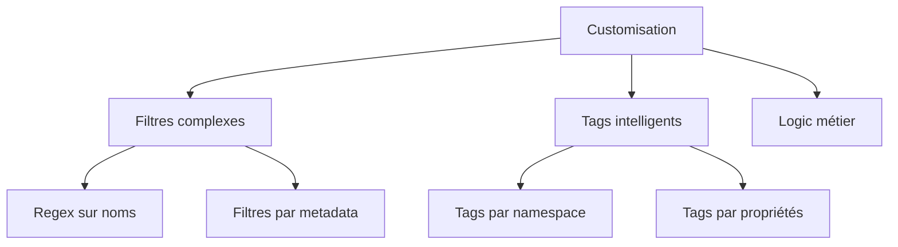

### Filtres sur mesure

Modifiez le code pour des filtres plus malins :

```python
# Exemple : Filtrer par pattern de nom
def _discover_tables(self) -> List[PolarisTable]:
    tables = super()._discover_tables()
    # Seulement les tables qui commencent par "prod_"
    return [t for t in tables if t.table_name.startswith("prod_")]
```

### Tags intelligents

Ajoutez des tags automatiques basés sur les métadonnées :

```python
def _get_table_tags(self, polaris_table: PolarisTable) -> List[TagLabel]:
    tags = []
    
    # Tag selon le namespace
    if "sensitive" in polaris_table.namespace_name:
        tags.append(TagLabel(tagFQN="PII.Sensitive"))
    
    # Tag selon les propriétés de la table
    props = polaris_table.metadata.get("metadata", {}).get("properties", {})
    if props.get("data_classification") == "critical":
        tags.append(TagLabel(tagFQN="Tier.Gold"))
    
    return tags
```

> **⚠️ Attention :** Ces modifications nécessitent de bien connaître le code !

## �️ Développement (pour contribuer)

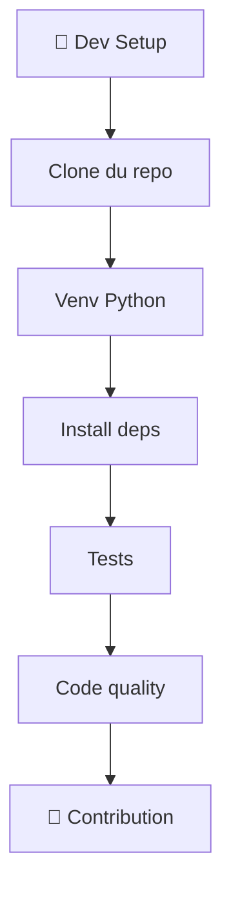

### Environnement de dev

```bash
# Cloner le repo
git clone https://github.com/monsau/openmetadata-polaris-connector.git
cd openmetadata-polaris-connector

# Environnement virtuel
python -m venv venv
source venv/bin/activate        # Linux/Mac
# venv\Scripts\activate         # Windows

# Installation en mode dev
pip install -r requirements.txt
pip install -e .
```

### Tests et qualité

```bash
# Lancer les tests
pytest tests/

# Tests avec couverture
pytest --cov=connectors tests/

# Formatage du code
black connectors/

# Vérification du style
flake8 connectors/

# Vérification des types
mypy connectors/
```

> **📝 Contribution :** Pull requests bienvenues ! Suivez juste les standards de code.

## 🤝 Contribuer au projet

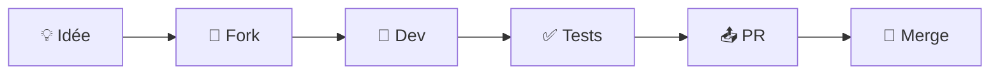

**Processus simple :**
1. Fork le repo
2. Créer une branche : `git checkout -b ma-super-feature`
3. Coder + tests
4. Vérifier la qualité : `black`, `flake8`, `mypy`
5. Commit : `git commit -am 'Ajout de ma super feature'`
6. Push : `git push origin ma-super-feature`
7. Créer une Pull Request

---

## � Contact & Support

**Développeur :** Mustapha Fonsau  
**Email :** mfonsau@talentys.eu  
**LinkedIn :** [mustapha-fonsau](https://www.linkedin.com/in/mustapha-fonsau/)

> 🐛 **Issues :** Utilisez la page GitHub Issues pour les bugs et demandes de fonctionnalités

---

## 🏷️ Versions

| Version | Date | Nouveautés |
|---------|------|------------|
| **1.0.0** | Oct 2025 | 🎉 Release initiale |
| | | ✅ Support OAuth2, API Key, Basic auth |
| | | ✅ Mapping complet des schémas Iceberg |
| | | ✅ Filtres et tags configurables |

---

## 🙏 Remerciements

Un grand merci à :
- **[Apache Polaris](https://polaris.apache.org/)** pour le service de catalogue
- **[OpenMetadata](https://open-metadata.org/)** pour la plateforme de métadonnées
- **[Apache Iceberg](https://iceberg.apache.org/)** pour le format de tables

> 💝 **Et merci à tous ceux qui contribuent à l'écosystème open source !**