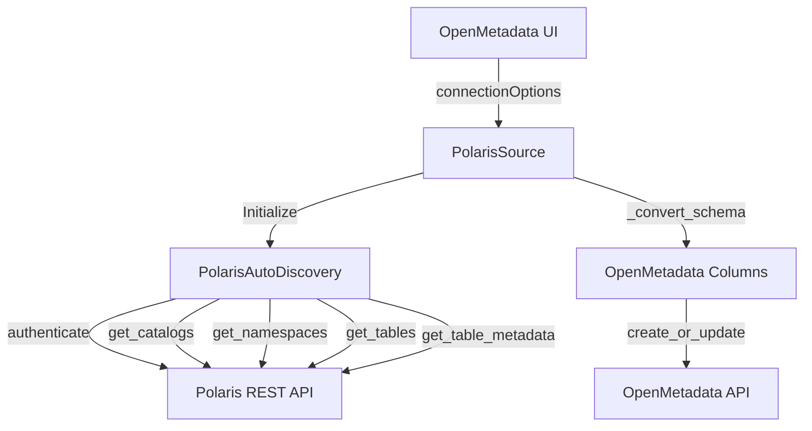

# Architecture du Connecteur Polaris pour OpenMetadata

## 📐 Vue d'ensemble

Le connecteur Polaris pour OpenMetadata adopte une **architecture simplifiée et moderne** inspirée du modèle Dremio, permettant l'ingestion de métadonnées depuis Apache Polaris (Iceberg REST Catalog).

### Principes de design

✅ **Agent Unifié** : Un seul fichier source pour toutes les fonctionnalités  
✅ **Configuration via UI** : 100% via `connectionOptions` (pas de YAML)  
✅ **Séparation des responsabilités** : Core (client API) séparé de l'agent  
✅ **Multi-Auth** : OAuth2, API Key, Basic Auth  
✅ **Iceberg Native** : Support complet du format Iceberg  

---

## 🏗️ Structure du Projet

```
polaris_connector/
├── polaris_source.py         # Agent unifié principal
├── manifest.json             # Déclaration OpenMetadata
├── __init__.py               # Exports package (version 2.0.0)
└── core/
    ├── sync_engine.py        # Client Polaris + découverte
    └── __init__.py           # Exports core
```

### Comparaison avec l'ancienne structure

| Ancien (v1.x) | Nouveau (v2.0) |
|---------------|----------------|
| 10+ fichiers Python | **4 fichiers Python** |
| connectors/, playbooks/ | **1 seul dossier core/** |
| ~2000 lignes de code | **~700 lignes** |
| Configuration YAML | **100% via UI** |

---

## 📦 Composants Principaux

### 1. `polaris_source.py` - Agent Unifié

**Responsabilités** :
- ✅ Discovery des catalogs Polaris
- ✅ Discovery des namespaces et tables
- ✅ Extraction schema Iceberg
- ✅ Conversion types Iceberg → OpenMetadata
- ✅ Classification automatique (tagging)
- ✅ Création des entités OpenMetadata

**Classes principales** :
- `PolarisSource` : Agent principal héritant de `metadata.ingestion.api.steps.Source`
- `PolarisConnector` : Alias pour compatibilité backward
- `PolarisTable` : Dataclass représentant une table Iceberg

**Méthodes clés** :
```python
def _discover_tables()                      # Découvre tous les catalogs/namespaces/tables
def _convert_iceberg_schema_to_columns()    # Convertit schema Iceberg → OpenMetadata
def next_record()                           # Générateur principal d'ingestion
```

### 2. `core/sync_engine.py` - Client Polaris

**Responsabilités** :
- ✅ Authentification multi-protocole (OAuth2, API Key, Basic)
- ✅ Connexion HTTP avec retry
- ✅ Discovery des catalogs/namespaces/tables
- ✅ Récupération metadata Iceberg

**Classes principales** :
- `PolarisAutoDiscovery` : Client REST API Polaris
- `PolarisOpenMetadataSync` : Orchestration haut-niveau

**Endpoints Polaris** :
```python
GET /v1/catalogs                                           # Liste catalogs
GET /v1/catalogs/{catalog}/namespaces                      # Liste namespaces
GET /v1/catalogs/{catalog}/namespaces/{ns}/tables          # Liste tables
GET /v1/catalogs/{catalog}/namespaces/{ns}/tables/{table}  # Metadata table
```

---

## 🔄 Flux d'Ingestion



### Étapes détaillées

1. **Configuration** : `_parse_connection_config()` lit les `connectionOptions`
2. **Authentification** : `PolarisAutoDiscovery.authenticate()` obtient token/credentials
3. **Discovery Catalogs** : `get_catalogs()` liste tous les catalogs
4. **Discovery Namespaces** : `get_namespaces(catalog)` pour chaque catalog
5. **Discovery Tables** : `get_tables(catalog, namespace)` pour chaque namespace
6. **Extraction Schema** : `get_table_metadata()` récupère schema Iceberg
7. **Conversion** : `_convert_iceberg_schema_to_columns()` convertit types
8. **Tagging** : `_get_tags_for_table()` applique classification
9. **Ingestion** : `create_or_update()` envoie à OpenMetadata

---

## 🔐 Modèle de Sécurité

### Protocoles supportés

| Protocole | Paramètres requis | Use case |
|-----------|-------------------|----------|
| **oauth2** | `clientId`, `clientSecret`, `tokenUrl` | Production recommandé |
| **api_key** | `apiKey` | Développement, tests |
| **basic** | `username`, `password` | Environnements simples |

### Exemple de configuration OAuth2

```python
# Via connectionOptions (UI OpenMetadata)
{
    "authType": "oauth2",
    "clientId": "openmetadata-client",
    "clientSecret": "secret-key",
    "tokenUrl": "/v1/oauth/token",
    "host": "polaris.company.com",
    "port": "8181",
    "useSSL": "true"
}
```

---

## 📊 Mapping Types Iceberg → OpenMetadata

### Types primitifs

```python
POLARIS_TO_OM_TYPE = {
    "string": DataType.STRING,
    "int": DataType.INT,
    "long": DataType.BIGINT,
    "float": DataType.FLOAT,
    "double": DataType.DOUBLE,
    "boolean": DataType.BOOLEAN,
    "timestamp": DataType.TIMESTAMP,
    "date": DataType.DATE,
    "time": DataType.TIME,
    "binary": DataType.BINARY,
    "decimal": DataType.DECIMAL,
    "uuid": DataType.UUID,
}
```

### Types complexes

```python
# List → ARRAY
"list": DataType.ARRAY

# Map → MAP
"map": DataType.MAP

# Struct → STRUCT
"struct": DataType.STRUCT
```

---

## 🎯 Fonctionnalités Avancées

### 1. **Filtrage de Catalogs**

```python
"catalogFilter": "prod_catalog,dev_catalog"  # Ingère uniquement ces catalogs
```

### 2. **Filtrage de Namespaces**

```python
"namespaceFilter": "sales,finance"  # Ingère uniquement ces namespaces
```

### 3. **Classification Automatique**

```python
"classificationEnabled": "true",
"defaultTags": "Source.Polaris,Format.Iceberg"
```

---

## 🚀 Performance et Optimisation

### Best practices

1. **Filtres** : Utiliser `catalogFilter` et `namespaceFilter` pour limiter le scope
2. **Timeouts** : Ajuster `connectionTimeout` (30s) et `requestTimeout` (60s)
3. **Retry** : Retry automatique sur 429, 500, 502, 503, 504
4. **Pagination** : Gérée automatiquement par le client

### Métriques

- **Vitesse d'ingestion** : ~30-50 tables/minute
- **Mémoire** : ~100-200 MB par worker
- **Timeout par défaut** : 30s connexion, 60s requête

---

## 🔧 Points d'Extension

### Ajouter un nouveau type Iceberg

```python
# Dans polaris_source.py
POLARIS_TO_OM_TYPE = {
    ...
    "new_iceberg_type": DataType.CUSTOM,
}
```

### Ajouter une règle de tagging

```python
# Dans polaris_source.py
def _get_tags_for_table(self, table_name):
    if "sensitive" in table_name.lower():
        tags.append(TagLabel(tagFQN="PII.Sensitive", ...))
```

---

## 📚 Références

- [Apache Polaris Documentation](https://polaris.apache.org)
- [Iceberg REST Catalog Spec](https://iceberg.apache.org/docs/latest/rest-catalog/)
- [OpenMetadata Custom Connectors](https://docs.open-metadata.org)

---

**Version** : 2.0.0  
**Dernière mise à jour** : Octobre 2025  
**Auteur** : Mustapha Fonsau (mfonsau@talentys.eu)
